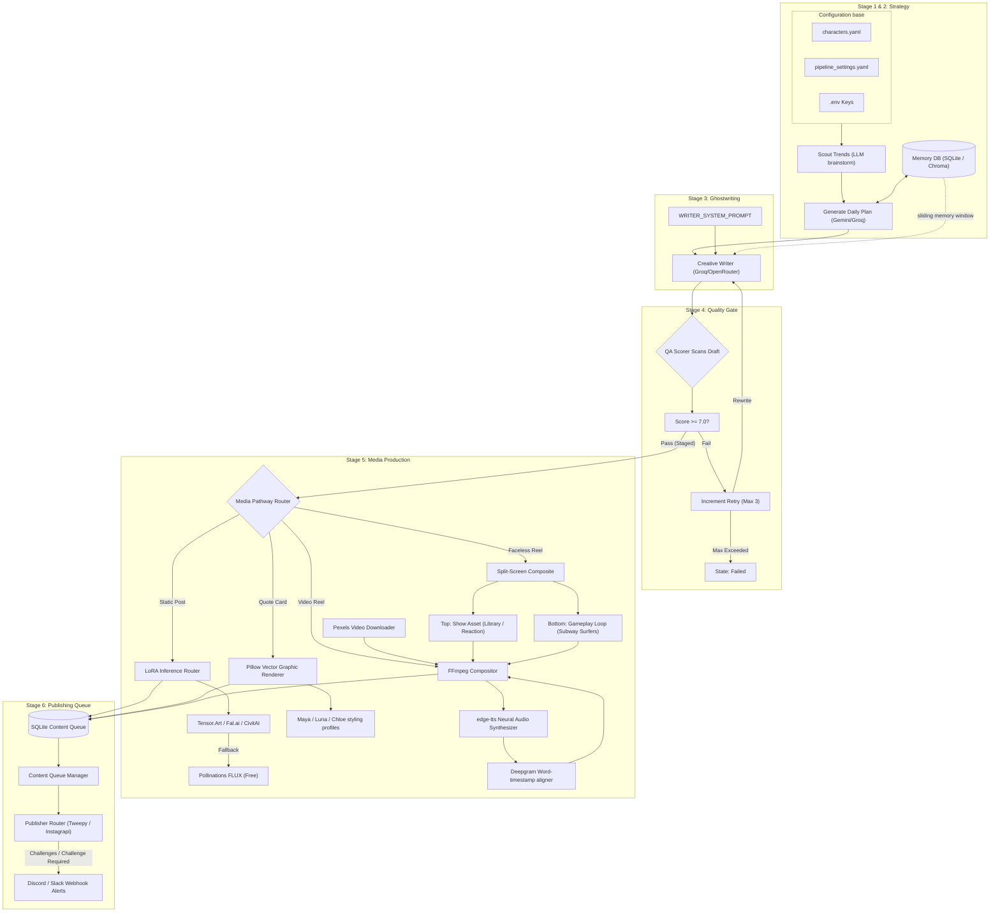

# AI Content Engine — Autonomous Social Media Lifecycle & Visual Pipeline

The **AI Content Engine** is a production-ready, highly engineered autonomous framework designed to simulate lifelike social media influencers ("AI characters") and operate automated theme channels ("faceless accounts"). 

Operating entirely on CPU, the engine integrates real-time trend intelligence, narrative memory continuity, multi-model LLM routing, strict quality gates, and high-fidelity video/image rendering to schedule, write, produce, and dispatch social media content automatically.

---

## 1. Project Vision & Core Capabilities

The vision of the Content Engine is to create a fully autonomous, self-correcting lifecycle for social media creators that rivals human-made quality, maintaining strict narrative continuity without human intervention.

*   **Real-time Niche Scouting**: Dynamically scans trending topics and weaves them into character-specific storylines.
*   **Narrative Continuity & Memory**: Employs rolling narrative windows, weekly story arcs, and historical event memory databases to ensure characters remember past events and never duplicate topics.
*   **Visual Identity Consistency**: Integrates custom LoRA prompt expansion structures (e.g., using `ohwx_maya` triggers and physical anchors) to render consistent character portraits across daily posts without training expensive local models.
*   **CPU-Optimized Media Composer**: Compiles professional-grade vertical Reels (1080x1920) with word-by-word synced kinetic captions, background audio, and split-screen video loops in under 30 seconds entirely on standard CPU.
*   **Self-Correcting QA Gate**: Validates drafted content against personality guidelines, engagement hooks, and safety parameters. Automatically feeds revision feedback back to writing models for up to 3 rewrite iterations before flagging.
*   **Admin Dashboard Cockpit**: A FastAPI-based admin panel enabling human operators to monitor queues, edit upcoming posts, adjust settings, and view logs.

---

## 2. End-to-End Pipeline Architecture

This diagram shows how raw configs, trend intelligence, API clients, database queues, and media rendering pipelines flow through the system:

---

## 3. Codebase Directory Mapping

| Directory / File | Type | Purpose |
| :--- | :--- | :--- |
| `config/` | Folder | Contains central settings and active character profiles. |
| ├─ [characters.yaml](file:///D:/Open%20Projects/Content%20Engine/config/characters.yaml) | YAML | Identity profiles, visual triggers, voice IDs, and LoRA paths. |
| └─ [pipeline_settings.yaml](file:///D:/Open%20Projects/Content%20Engine/config/pipeline_settings.yaml) | YAML | System knobs (QA scores, LLM temps, provider lists, styles). |
| `data/` | Folder | Local storage databases, temporary sessions, and asset libraries. |
| ├─ `content_engine.sqlite3` | SQLite | Main database storing character queue logs, narrative events, and arcs. |
| ├─ `media_library/` | Folder | Collections of images, reaction clips, and gameplay video loops. |
| └─ `sessions/` | Folder | Cached login settings for social platform APIs (Instagrapi sessions). |
| `src/` | Folder | Python source modules for the content engine. |
| ├─ `core/` | Folder | Core config structures, custom exceptions, and system monitoring. |
| │  ├─ [config.py](file:///D:/Open%20Projects/Content%20Engine/src/core/config.py) | Python | Central config parser loading variables from `.env`. |
| │  └─ [monitoring.py](file:///D:/Open%20Projects/Content%20Engine/src/core/monitoring.py) | Python | Webhook alerting engine for sending Discord notifications. |
| ├─ `llm/` | Folder | LLM integration scripts, fallback routers, and prompt strings. |
| │  ├─ [router.py](file:///D:/Open%20Projects/Content%20Engine/src/llm/router.py) | Python | Dynamically routes prompts through Gemini REST, Groq, or OpenRouter. |
| │  └─ [prompts.py](file:///D:/Open%20Projects/Content%20Engine/src/llm/prompts.py) | Python | Loads and structures planning, writing, and QA system prompts. |
| ├─ `memory/` | Folder | DB schema setups, memory window compilers, and session initializers. |
| │  ├─ [db.py](file:///D:/Open%20Projects/Content%20Engine/src/memory/db.py) | Python | SQLAlchemy database model definitions (Character, Post, Event, Arc). |
| │  ├─ [manager.py](file:///D:/Open%20Projects/Content%20Engine/src/memory/manager.py) | Python | Formulates contextual prompts for story writing and prevents overlaps. |
| │  └─ [init_db.py](file:///D:/Open%20Projects/Content%20Engine/src/memory/init_db.py) | Python | Instantiates SQLite tables and syncs character config files. |
| ├─ `generation/` | Folder | Generative pipelines for writing, drawing, voice, and video compositing. |
| │  ├─ [consistency.py](file:///D:/Open%20Projects/Content%20Engine/src/generation/consistency.py) | Python | Custom LoRA prompt builders and remote GPU image fallbacks. |
| │  ├─ [image.py](file:///D:/Open%20Projects/Content%20Engine/src/generation/image.py) | Python | Local quote card draws (Pillow) and image fetch actions. |
| │  ├─ [tts.py](file:///D:/Open%20Projects/Content%20Engine/src/generation/tts.py) | Python | Microsoft Edge neural voice audio synthesizer. |
| │  ├─ [video.py](file:///D:/Open%20Projects/Content%20Engine/src/generation/video.py) | Python | Word-by-word synced ASS subtitle creator and FFmpeg compositor. |
| │  ├─ [media_library.py](file:///D:/Open%20Projects/Content%20Engine/src/generation/media_library.py) | Python | Library manifest scanning, searches, and meme layout draws. |
| │  ├─ [planner.py](file:///D:/Open%20Projects/Content%20Engine/src/generation/planner.py) | Python | Trend scouts, calendar planners, and caption writer calls. |
| │  ├─ [qa.py](file:///D:/Open%20Projects/Content%20Engine/src/generation/qa.py) | Python | Score evaluation gates and fail-safe fallback retry counters. |
| │  └─ [lora_trainer.py](file:///D:/Open%20Projects/Content%20Engine/src/generation/lora_trainer.py) | Python | Packages local datasets and triggers Fal.ai model training jobs. |
| ├─ `publishing/` | Folder | Social platform API connectors and queue dispatch managers. |
| │  ├─ [publisher.py](file:///D:/Open%20Projects/Content%20Engine/src/publishing/publisher.py) | Python | Instagrapi (Instagram) and Tweepy (X) uploaders with human typing delays. |
| │  └─ [queue_manager.py](file:///D:/Open%20Projects/Content%20Engine/src/publishing/queue_manager.py) | Python | Pulls due posts, checks safety caps, and sets exponential retry delays. |
| ├─ `scheduling/` | Folder | Daemon schedulers and automated daily loop orchestration. |
| │  ├─ [scheduler.py](file:///D:/Open%20Projects/Content%20Engine/src/scheduling/scheduler.py) | Python | Automated core orchestrator syncing and executing the lifecycle. |
| │  └─ [evolve_arcs.py](file:///D:/Open%20Projects/Content%20Engine/src/scheduling/evolve_arcs.py) | Python | Background compiler updating weekly character arcs based on histories. |
| ├─ `dashboard/` | Folder | Admin control panel app. |
| │  ├─ [app.py](file:///D:/Open%20Projects/Content%20Engine/src/dashboard/app.py) | Python | FastAPI web app defining settings endpoints, queues, and run loops. |
| │  └─ `templates/index.html` | HTML | Premium UI dashboard template for complete visual administration. |
| ├─ [generate_all.py](file:///D:/Open%20Projects/Content%20Engine/src/generate_all.py) | Python | End-to-end dry-run production script testing the entire pipeline. |
| `scratch/` | Folder | Experimental scripts and one-off verification suites. |
| ├─ [generate_consistency_suite.py](file:///D:/Open%20Projects/Content%20Engine/scratch/generate_consistency_suite.py) | Python | Visual/narrative asset consistency tests for active characters. |
| └─ [generate_maya.py](file:///D:/Open%20Projects/Content%20Engine/scratch/generate_maya.py) | Python | Direct test of Maya's visual consistency prompt portrait generation. |

---

## 4. Tuning Knobs & Configuration Levers

Central configurations are loaded from `config/pipeline_settings.yaml`. Changes take effect instantly upon the next lifecycle check:

### Central Knobs (`pipeline_settings.yaml` / `.env`)

| Knob Name | Type | Recommended Value | What It Controls / Tuning Advice |
| :--- | :--- | :--- | :--- |
| `qa_threshold` | Float | `7.0` | Strictness of the editor gate (1-10). Increase to `8.5` for premium branding; decrease to `6.0` to speed up queues on difficult models. |
| `max_retries` | Int | `3` | Number of times the LLM attempts to rewrite a rejected caption before marking it as permanently `failed`. |
| `writer_temperature`| Float | `0.85` | Creativity slider for creative writing. High values generate engaging, human-like typos and slang. |
| `planner_temperature`| Float | `0.70` | Balance slider for content planning. High values plan diverse, wacky setups; low values stick close to core niche themes. |
| `memory_window_posts`| Int | `3` | The sliding post window. Increase to `5` to prevent repetitive topics across multiple days (consumes more context tokens). |
| `memory_window_events`| Int | `5` | The rolling narrative event memory depth. Controls how far back the character remembers past actions/soldering events. |
| `posts_per_day` | Int | `2` | Number of posts generated and scheduled per character per daily planning cycle. |
| `human_delay_max` | Int | `120` | Maximum random delay in seconds added before posting to emulates human typing and bypass social spam filters. |

---

## 5. Technical Implementation Details

### Multi-Model LLM Fallback Router
Implemented in `src/llm/router.py`, the dynamic router ensures 100% system uptime:
*   **Google Gemini (Primary Planning)**: Accessed via direct REST queries to bypass local Pydantic version conflicts. Utilizes `gemini-2.0-flash` due to its huge context window and stable free tier limits.
*   **Groq API (Primary Creative & QA)**: Connects to standard endpoints using `llama-3.3-70b-versatile` to write captions, scripts, and execute high-speed, logical QA evaluation.
*   **OpenRouter API (Fallback)**: Configured with `meta-llama/llama-3.1-8b-instruct:free` as an active fallback. If Groq or Gemini hit rate limits, tasks cascade automatically without crashing the lifecycle.

### Media Production Pathways
The media pipeline (`src/generation/`) routes staged posts into three distinct visual/vocal compositing engines:
1.  **LoRA Visual Consistency (Portraits)**: `ConsistencyPromptBuilder` translates a short description (e.g. *"soldering at a desk"*) into a realistic photography prompt. It prepends a locked, prose **`seed_descriptor`** plus the character's visual-identity anchors (hair, eyes, skin, build, clothing) and appends a strict negative prompt to block CGI/plastic-skin looks. When a trained LoRA is available (Tensor.Art → Fal.ai → CivitAI), the trigger word anchors the face; **on the free tier (no LoRA), a stable per-character `seed` is passed to the Pollinations FLUX fallback so the same face renders on every post** — this is what guarantees character consistency without a paid GPU/LoRA. The fallback chain is Tensor.Art → Fal.ai → CivitAI → Pollinations FLUX.
2.  **Pillow Quote Cards (Graphics)**: Generates square, branded card templates offline. Maya’s coding profile applies a console theme (deep space background, neon cyan monospace code text, neon pink accent borders, using `consola.ttf`). Luna’s profile draws cozy literary graphics (warm cream backgrounds, espresso Georgia serif text, dusty rose accents).
3.  **FFmpeg CPU Reel Compositor (Video)**: Synthesizes high-quality speech voiceover via `edge-tts`. Sends audio to Deepgram’s `nova-2` API to extract high-precision word-level alignment timestamps. Converts alignments into an Advanced SubStation Alpha (`.ass`) caption sheet styling text in white and active words in yellow, scaled center-screen. Runs a CPU-efficient FFmpeg filter stack to crop background vertical clips to 1080x1920, overlay subtitles, map audio tracks, and output a finished vertical Reel in under 20 seconds.
4.  **Split-Screen Faceless Blender**: Combines gameplay B-roll footage (Minecraft/Subway Surfers) on the bottom half with a library show asset/reaction screenshot on the top half (using `vstack=inputs=2`). Synchronizes ASS captions center-screen across the stacked output.

---

## 6. Testing, Verification & QA Progress

We have established and run several automated test suites to verify system modules, API connections, and media rendering.

### The Staged Queue State Machine
Posts inside the `content_queue` SQLite table transition through the following states during verification:
`planned` (Topic and hook scheduled) ➔ `scripted` (Copy/tweet written by LLM) ➔ `staged` (Passed QA Gate & media generated) ➔ `published` (Successfully posted to Instagram/X)

### Test Suites Executed

#### 1. Core Generation Pipeline Test (`src/generation/test_generation.py`)
*   **Objective**: Verifies trend brainstorming, daily plan scheduling, database committing, creative copywriting, and QA scoring.
*   **Verification**: 
    *   Generates daily calendar plans for active character Maya based on trending niche research.
    *   Saves drafts to SQLite database, then retrieves them to run creative caption writing.
    *   Executes logical QA grading (grades on voice, engagement, continuity, and safety).
    *   Triggers dual visual media generation: Pillow Quote Card rendering for even posts, and Pollinations FLUX portrait generation for odd posts.
    *   Successfully created, QA-approved, and staged test posts with generated files in `outputs/`.

#### 2. Full Video compositing Integration Test (`src/generation/test_video.py`)
*   **Objective**: Verifies neural speech generation, word transcription, stock video download, and FFmpeg video compositing.
*   **Verification**:
    *   Takes a sample script about Dragon Ball Z and synthesizes `edge-tts` voiceover using `en-US-GuyNeural`.
    *   Sends audio to Deepgram, successfully transcribing word timestamps.
    *   Queries Pexels Video API for "space aesthetic", downloads vertical video clips.
    *   Runs CPU FFmpeg compiler to center-crop video, overlay ASS subtitles, stitch audio, and outputs `outputs/test_reel_dbz.mp4`.
    *   **Result**: Confirmed working audio, accurate word alignments, correct crop bounds, and subtitle overlays.

#### 3. Phase 4 Integration & Stability Test (`src/generation/test_phase4.py`)
*   **Objective**: Verifies LoRA visual consistency prompts, library auto-scanning, graphic meme compositing, and split-screen faceless video stacking.
*   **Verification**:
    *   **LoRA prompt build**: Tests `ConsistencyPromptBuilder` to ensure character attributes (`ohwx_maya`, black textured hair) are injected.
    *   **Consistent portrait generation**: Outputs portrait at `outputs/test_maya_consistent.png`.
    *   **Media Library Auto-Scanner**: Auto-scans mocked paths for `dbz_verse` folder structure (`clips`, `images`, `reactions`, `audio`), builds `manifest.json`, and tests keyword searching.
    *   **Meme Card Composer**: Combines consistent portrait with Segoe UI text header and watermark `@maya.tech`, saving `outputs/test_maya_meme.png`.
    *   **Split-Screen Composite**: Stitches a library show portrait on top and a downloaded gameplay clip on the bottom, synching word-by-word highlighted captions, saving `outputs/test_split_screen_faceless_reel.mp4`.
    *   **Result**: All Phase 4 assets successfully created and validated on CPU.

#### 4. Character Visual Consistency Suite (`scratch/generate_consistency_suite.py`)
*   **Objective**: Validates multi-asset generation for character story arcs, ensuring visual consistency across multiple portraits and videos.
*   **Verification**:
    *   Generates 3 consistent portraits of Maya (`maya_consistent_1.png` - soldering at workbench, `maya_consistent_2.png` - late-night coding coffee bug, `maya_consistent_3.png` - couch reading retro magazine).
    *   Generates 2 consistent videos (`maya_consistent_video_1.mp4` - venting about soldering mistakes, `maya_consistent_video_2.mp4` - explaining retro console modding).
    *   **Result**: Confirmed stable image prompts, realistic smartphone photo styles, and precise edge-tts vocal alignment.

---

## 7. Verified Media Assets Staged in `outputs/`

The following output assets have been fully compiled and verified during dry runs:

*   📸 **AI Portraits**:
    *   [test_maya_consistent.png](file:///D:/Open%20Projects/Content%20Engine/outputs/test_maya_consistent.png) - Messy brown hair, hazel highlights, metallic nostril stud ring, cozy workspace backdrop.
    *   [maya_consistent_1.png](file:///D:/Open%20Projects/Content%20Engine/outputs/maya_consistent_1.png) - Soldering custom translucent green Game Boy motherboard.
    *   [maya_consistent_2.png](file:///D:/Open%20Projects/Content%20Engine/outputs/maya_consistent_2.png) - Late-night coding bug with screen glare and white coffee mug.
*   🖼️ **Quote & Meme Cards**:
    *   [dryrun_post_2_quote.png](file:///D:/Open%20Projects/Content%20Engine/outputs/dryrun_post_2_quote.png) - Cyberpunk dark blue theme with pink borders and cyan footer `@maya.tech`.
    *   [test_maya_meme.png](file:///D:/Open%20Projects/Content%20Engine/outputs/test_maya_meme.png) - Twitter-style meme canvas featuring a consistent screenshot and centered caption.
*   🎥 **Vertical Reels**:
    *   [test_reel_dbz.mp4](file:///D:/Open%20Projects/Content%20Engine/outputs/test_reel_dbz.mp4) - Vertical crop B-roll of space flight, neural voiceover narration, and center-screen yellow subtitles.
    *   [test_split_screen_faceless_reel.mp4](file:///D:/Open%20Projects/Content%20Engine/outputs/test_split_screen_faceless_reel.mp4) - Stacked split-screen (top: portrait asset, bottom: gameplay action clip) with synchronized subtitle text.
    *   [maya_consistent_video_1.mp4](file:///D:/Open%20Projects/Content%20Engine/outputs/maya_consistent_video_1.mp4) - Synced voice narration explaining retro hardware soldered diodes.
